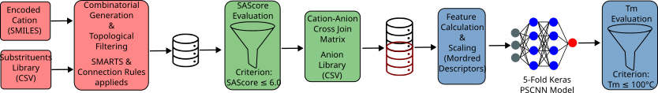

# ILs-screening-tm

An interactive, modular screening tool for ionic liquid cation generation, structural filtering, synthetic accessibility scoring, and machine learning-driven melting point ($T_m$) prediction.

This repository decouples core chemical and deep learning calculations from the interactive user interface, providing a clean production pipeline suitable for virtual materials discovery.

You can run the entire interactive pipeline directly in your browser without installing anything locally. Click the badge below to launch the pre-configured environment in Google Colab (remember to run the setup cell at the top to initialize the environment and display the interactive UI):

[](https://colab.research.google.com/github/Toucouere-Lorris/ILs-screening-tm/blob/main/tests/test_pipeline_GC.ipynb)

---

---

## 📂 Repository Structure

The repository is organized into distinct structural layers following software development standards:

```text
Git/
├── ils_screening_tm/         # Core production Python package
│   ├── __init__.py
│   ├── main.py               # Class ILsScreening, Pipeline orchestrator & UI (ipywidgets)
│   ├── data/                 # Fixed chemical source libraries
│   └── Models/               # Deep learning weights & feature scalers (PSCNN, LightGBM)
│
├── training_viscosity/       # Viscosity model logic and utilities
│   └── Viscosity.py          # Descriptor pipeline & feature engineering
│
├── tests/                    # Interactive testing & Validation notebooks
│   └── test_pipeline.ipynb   # Demo notebook to launch the UI
│
├── training/                 # Research environment for model development
│   ├── dataset/
│   │   └── tm_data.csv       # Curated experimental benchmark training set
│   └── train_tm_model.py     # Dual-Input Parallel-Scaffold CNN training script
│
├── pyproject.toml
└── README.md
```

## ⚙ The Screening Pipeline Workflow

The package orchestrates a sequential pipeline using an object-oriented API with method chaining (e.g., `.generation().sascore().tm().viscosity()`). All calculations modify an internal `self.df` state registry in memory, bypassing unnecessary disk read/write overhead:

### 1. Scaffold Selection & UI Interaction (`.generation()`)
* **Interactive Trigger:** Launches the interactive `ipywidgets` environment to choose a base cation, configure anchor sites, and define substituent groups.
* **Library Expansion:** Generates functionalized cations based on combinatorial substitution rules, validated against internal structural constraints.

### 2. Synthetic Accessibility Filtering & Anion Pairing (`.sascore()`)
* Computes SAScores (via RDKit contributions) and enforces a strict synthesis gate (default `threshold=6.0`) to discard overly complex entities.
* Automatically triggers a cross-join with the package's internal anion library to build the complete salt matrix.

### 3. Property Prediction Suite (`.tm()` & `.viscosity()`)
* **Deep Learning $T_m$ Prediction (`.tm()`):** Computes Mordred structural descriptors and feeds data into a 5-Fold Cross-Validation Ensemble of Parallel-Scaffold Convolutional Neural Networks (PSCNN). Applies a room-temperature/low-melting screening threshold (default $T_m \le 100^\circ\text{C}$).
* **Machine Learning Viscosity Prediction (`.viscosity()`):** Performs on-the-fly descriptor featurization and utilizes a calibrated **LightGBM** regressor to predict dynamic viscosity ($\eta$) as a function of temperature and pressure. Supports threshold-based pruning of candidates to enforce hydrodynamic constraints.

### 4. Advanced Diagnostics & Visual Reporting (`.plot()`)
* **Multi-Modal Analytics:** Supports diverse representations including `hist` for property distributions (e.g., $T_m, \eta$), `similarity` for structural clustering, and `matrix` for comparative property grid screening.
* **Automated Rendering:** Dynamically handles data scaling, labeling, and layout finalization for publication-quality visual output.

### 5. Data Serialization & Persistence (`.save()` & `.load()`)
* **Persistence (`.save()`):** Serializes the internal DataFrame (`self.df`) into `.csv` or `.xlsx` formats, allowing for precise output control via column filtering.
* **Rehydration (`.load()`):** Restores previously saved libraries, ensuring seamless workflow resumption and maintaining consistency across independent sessions.

## 🎛️ Interactive Dashboard Features

The screening pipeline comes with an intuitive ipywidgets-based graphical interface that allows you to easily configure your structural modifications and screening constraints in real-time.

### 1. Screening Bounds Settings (Advanced Performance)
At the top of the interface, two numeric entry boxes protect your workstation or server memory against combinatorics explosions:
* **Max Subts:** Controls the maximum number of unique substituents loaded from your library for each active chemical site family.
* **Max Comb:** Sets a hard absolute ceiling for the total number of generated cation structures. If the combinatorics estimation exceeds this number, the generation safely truncates to prevent Out of Memory crashes.

### 2. Scaffold Selection & Core Slicing
* **Cation Core Dropdown:** Select your available base cation scaffolds from the loaded database: Pyrrolidinium, Pyridinium, Piperidinium, Ammonium, Phosphonium, Sulfonium, Imidazolium.
* **Cut Atoms Selector:** Select one or multiple atom indices to dynamically remove them from the structure, opening up new coordination sites for branching.

### 3. Symmetries & Validation
* **Detected Symmetries:** Once an anchor placeholder (`[*]`) is detected on the remaining core structure, dropdown menus automatically appear to configure architectural symmetries and local substitution groups dynamically.
* **Validate & Launch Screening Button:** Automatically triggers the full sequence (`.set_scaffold()`, `.generation()`, `.sascore()`, `.tm()`) using your custom graphic selections.

## 🚀 Execution & Interactive UI

Testing and running the pipeline is containerized inside the `tests/` directory to protect production code from volatile Jupyter execution paths.

### 1. Initializing the Notebook Environment
To test the pipeline locally, open `tests/test_pipeline.ipynb` and execute the following setup block. It includes the `%autoreload` magic extension to seamlessly catch local `main.py` source modifications:

```python
import os
import sys

# Activate Jupyter auto-reload
%load_ext autoreload
%autoreload 2

# Append parent directory to sys.path so Python detects the package locally
sys.path.append(os.path.abspath('..'))

from ils_screening_tm.main import ILsScreening

# Instantiate the pipeline
ils = ILsScreening()

# Launch the interactive interface
ils.generation()
```

## 📦 Installation & Local Usage

### Standard Installation (via PyPI)
If you prefer to run the screening pipeline locally on your machine, the package is officially hosted on PyPI. You can install it and all its core dependencies with a single command:

```bash
pip install ils-screening-tm
```

### Local Installation
To install the package in editable development mode (useful if you want to modify the source code), clone the repository and run from the root directory:

```bash
pip install -e .
```
